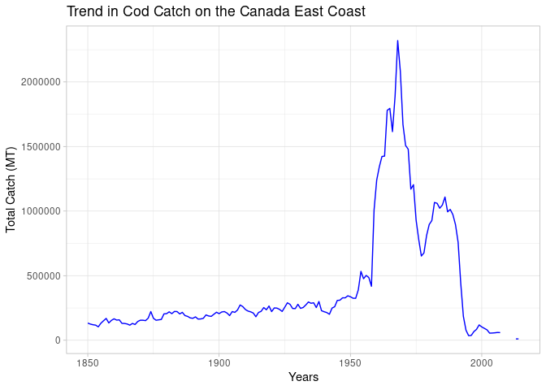
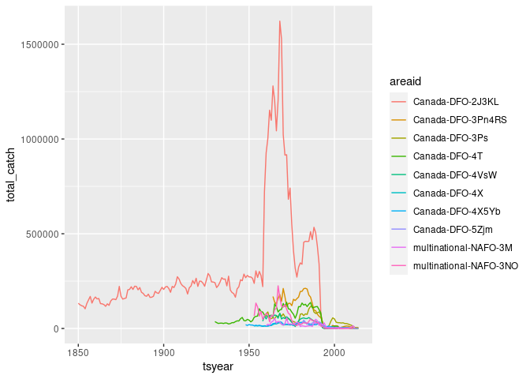

Examining Fishery Collapse
================
Joslyn Fu & Phoebe Goulden

This project examines current data (1950 to present) on overfishing and
fishery collapse. We compare our results to findings in the Worm et al.
(2006) paper which first reported on fishery collapse and its
implications for biodiversity.

## The Database

We will use data from the [RAM Legacy Stock Assessment
Database](https://doi.org/10.5281/zenodo.2542918)

``` r
library("tidyverse")
library("readxl")
#install a helper package to download data first
#install.packages("ramlegacy")
library("ramlegacy")
```

``` r
#download and unzip files
#overwrite = TRUE gets most updated version
download_ramlegacy(overwrite = TRUE)
```

``` r
ram <- ramlegacy::load_ramlegacy(tables = c("timeseries", "stock", "area", "tsmetrics"))
```

``` r
#join the 3 data tables we need
fish <- ram$timeseries %>%
  left_join(ram$stock, by = "stockid") %>%
  left_join(ram$tsmetrics, by = c("tsid" = "tsunique")) %>%
  left_join(ram$area, by = "areaid")
```

# Investigating the Decline of the North-Atlantic Cod

``` r
#filter out only cod
cod <- fish %>% 
  filter(scientificname == "Gadus morhua") %>% select(-commonname)       %>% distinct() 

#total cod catch on the Canada East Coast in metric tons
canada_cod_MT <- cod %>% 
  filter(tsid == "TCbest-MT", region == "Canada East Coast") %>%
  group_by(tsyear, scientificname) %>% 
  summarise(total_catch = sum(tsvalue)) 

canada_cod_MT %>%
  ggplot(aes(tsyear, total_catch)) + geom_line(color = "blue") + theme_light() + labs(x = "Years", y = "Total Catch (MT)", title = "Trend in Cod Catch on the Canada East Coast")
```

<!-- -->

Below is a similar figure from the Millenium Ecosystem Assessment
Project using the RAM data.


Our graph has a similar shape as the one above, reflecting the collapse
of the Canada East Coast cod fishery around 1992. However, our values
are much greater than in the orginal graph because we plotted total
catch per year rather than total landings. The landing value is the
number of fish brought back to the dock, whereas total catch is all fish
caught. Total catch is a much larger value since many unwanted fish are
thrown back before reaching shore. Additionally, we used data for the
entire Canada East Coast, which includes 10
subregions.

``` r
fish %>% filter(scientificname == "Gadus morhua", region == "Canada East Coast") %>% count(areaname)
```

    ##                                                 areaname    n
    ## 1                                  Eastern Scotian Shelf  201
    ## 2                                            Flemish Cap  419
    ## 3                                           Georges Bank  497
    ## 4                          Northern Gulf of St. Lawrence  899
    ## 5                                   Southern Grand Banks  292
    ## 6                          Southern Gulf of St. Lawrence 1063
    ## 7                 Southern Labrador-Eastern Newfoundland 3064
    ## 8                                        St. Pierre Bank  822
    ## 9                                  Western Scotian Shelf  448
    ## 10 Western Scotian Shelf, Bay of Fundy and Gulf of Maine  359

``` r
fish %>% 
  filter(tsid == "TCbest-MT", region == "Canada East Coast") %>%
  group_by(tsyear, scientificname, areaid) %>% 
  summarise(total_catch = sum(tsvalue, na.rm=TRUE)) %>% 
  filter(scientificname == "Gadus morhua") %>%
  ggplot(aes(tsyear, total_catch, col = areaid)) + 
  geom_line()
```

<!-- -->

**How does your graph compare to the one presented above?**

-----

# Exercise 2: Group Assignment

## Stock Collapses

We seek to replicate the temporal trend in stock declines shown in [Worm
et al 2006](http://doi.org/10.1126/science.1132294):


``` r
fish %>% 
  filter(tsid == "TCbest-MT", region == "Canada East Coast") %>%
  group_by(tsyear, scientificname) %>% 
  summarise(total_catch = sum(tsvalue), total_catch < .10*cummax(tsvalue)) %>%
  filter(scientificname == "Gadus morhua") 
```

    ## # A tibble: 882 x 4
    ## # Groups:   tsyear, scientificname [165]
    ##    tsyear scientificname total_catch `total_catch < 0.1 * cummax(tsvalue)`
    ##     <dbl> <chr>                <dbl> <lgl>                                
    ##  1   1850 Gadus morhua        133000 FALSE                                
    ##  2   1851 Gadus morhua        125000 FALSE                                
    ##  3   1852 Gadus morhua        120000 FALSE                                
    ##  4   1853 Gadus morhua        117000 FALSE                                
    ##  5   1854 Gadus morhua        104000 FALSE                                
    ##  6   1855 Gadus morhua        132000 FALSE                                
    ##  7   1856 Gadus morhua        151000 FALSE                                
    ##  8   1857 Gadus morhua        169000 FALSE                                
    ##  9   1858 Gadus morhua        134000 FALSE                                
    ## 10   1859 Gadus morhua        154000 FALSE                                
    ## # … with 872 more rows

``` r
#fish %>% filter(scientificname == "Gadus morhua") %>% count(areaname)
#fish %>% 
 # filter(tsid == "TCbest-MT", region == "Canada East Coast") %>%
  #group_by(tsyear, scientificname) %>% 
  #summarize(runmax()) %>%
 # filter(scientificname == "Gadus morhua") 
```

``` r
collapse <- fish %>%
  filter(tsid == "TCbest-MT") %>%
  group_by(tsyear, scientificname) %>% 
  summarise(total_catch = sum(tsvalue, na.rm = TRUE)) %>%
  group_by(scientificname) %>%
  mutate(current_collapse = total_catch < 0.10 * cummax(total_catch),
         ever_collapsed = cumsum(current_collapse) > 0) %>%
  ungroup()

collapse
```

    ## # A tibble: 17,589 x 5
    ##    tsyear scientificname            total_catch current_collapse ever_collapsed
    ##     <dbl> <chr>                           <dbl> <lgl>            <lgl>         
    ##  1   1800 Hippoglossus hippoglossus           0 FALSE            FALSE         
    ##  2   1801 Hippoglossus hippoglossus           0 FALSE            FALSE         
    ##  3   1802 Hippoglossus hippoglossus           0 FALSE            FALSE         
    ##  4   1803 Hippoglossus hippoglossus           0 FALSE            FALSE         
    ##  5   1804 Hippoglossus hippoglossus           0 FALSE            FALSE         
    ##  6   1805 Hippoglossus hippoglossus           0 FALSE            FALSE         
    ##  7   1806 Hippoglossus hippoglossus           0 FALSE            FALSE         
    ##  8   1807 Hippoglossus hippoglossus           0 FALSE            FALSE         
    ##  9   1808 Hippoglossus hippoglossus           0 FALSE            FALSE         
    ## 10   1809 Hippoglossus hippoglossus           0 FALSE            FALSE         
    ## # … with 17,579 more rows

``` r
collapse %>%
  group_by(tsyear) %>%
  summarise(total_collapse = sum(current_collapse), cumulative_collase = sum(ever_collapsed)) 
```

    ## # A tibble: 219 x 3
    ##    tsyear total_collapse cumulative_collase
    ##     <dbl>          <int>              <int>
    ##  1   1800              0                  0
    ##  2   1801              0                  0
    ##  3   1802              0                  0
    ##  4   1803              0                  0
    ##  5   1804              0                  0
    ##  6   1805              0                  0
    ##  7   1806              0                  0
    ##  8   1807              0                  0
    ##  9   1808              0                  0
    ## 10   1809              0                  0
    ## # … with 209 more rows

``` r
fish  %>%
  filter(tsyear == "1922") %>%
  count(scientificname) 
```

    ##                   scientificname  n
    ## 1             Anoplopoma fimbria 52
    ## 2            Atheresthes stomias 37
    ## 3            Chrysophrys auratus 22
    ## 4               Eopsetta jordani 17
    ## 5                   Gadus morhua 22
    ## 6        Glyptocephalus zachirus  7
    ## 7        Hexagrammos decagrammus 13
    ## 8      Hippoglossus hippoglossus 18
    ## 9        Hippoglossus stenolepis 18
    ## 10            Homarus americanus  8
    ## 11       Hoplostethus atlanticus 40
    ## 12                Jasus lalandii 90
    ## 13            Katsuwonus pelamis  2
    ## 14 Lopholatilus chamaeleonticeps 14
    ## 15          Lutjanus campechanus 37
    ## 16           Merluccius capensis 34
    ## 17          Merluccius paradoxus 38
    ## 18         Microstomus pacificus 19
    ## 19      Nemadactylus macropterus 48
    ## 20  Neoplatycephalus richardsoni 44
    ## 21            Oncorhynchus nerka 12
    ## 22              Ostrea chilensis 10
    ## 23             Parophrys vetulus 26
    ## 24         Pleuronectes platessa  2
    ## 25                    Raja rhina 19
    ## 26         Scomberomorus cavalla 18
    ## 27       Scomberomorus maculatus 17
    ## 28             Scorpaena guttata 17
    ## 29          Sebastes auriculatus 15
    ## 30               Sebastes aurora 18
    ## 31             Sebastes caurinus 15
    ## 32        Sebastes chlorostictus 38
    ## 33              Sebastes crameri 18
    ## 34            Sebastes diploproa 18
    ## 35            Sebastes elongatus 19
    ## 36            Sebastes entomelas 38
    ## 37            Sebastes fasciatus 31
    ## 38             Sebastes flavidus  7
    ## 39               Sebastes goodei 38
    ## 40                Sebastes levis 36
    ## 41              Sebastes maliger  6
    ## 42             Sebastes melanops 73
    ## 43             Sebastes mystinus 18
    ## 44            Sebastes nebulosus 53
    ## 45           Sebastes norvegicus  2
    ## 46             Sebastes pinniger 36
    ## 47           Sebastes ruberrimus 37
    ## 48            Sebastes zacentrus  7
    ## 49        Sebastolobus alascanus 31
    ## 50                   Solea solea  2
    ## 51             Squalus acanthias 33
    ## 52              Squalus suckleyi 19
    ## 53        Thaleichthys pacificus  3
