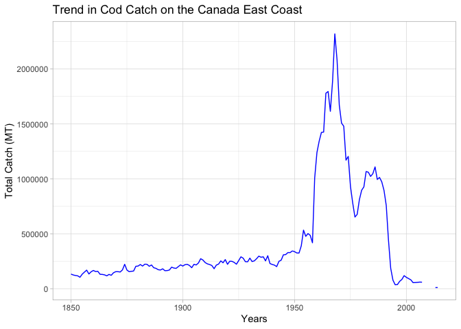

Unit 3: Fisheries Collapse Module
=================================

This module will focus on understanding and replicating fisheries stock assessment data and fisheries collapse.

Instead of working with independent dataframes, we will be working with a large relational database which contains many different tables of different sizes and shapes, but that all all related to eachother through a series of different ids.

The Database
------------

We will use data from the [RAM Legacy Stock Assessment Database](https://doi.org/10.5281/zenodo.2542918)

``` r
library("tidyverse")
library("readxl")
#install a helper package to download data first
#install.packages("ramlegacy")
library("ramlegacy")
```

``` r
#download and unzip files
#overwrite = TRUE gets most updated version
download_ramlegacy(overwrite = TRUE)
```

``` r
ram <- ramlegacy::load_ramlegacy(tables = c("timeseries", "stock", "area", "tsmetrics"))
```

``` r
fish <- ram$timeseries %>%
  left_join(ram$stock, by = "stockid") %>%
  left_join(ram$tsmetrics, by = c("tsid" = "tsunique"))
```

``` r
#filter out only cod
cod <- fish %>% 
  filter(scientificname == "Gadus morhua") %>% select(-commonname)       %>% distinct() 

#total cod catch on the Canada East Coast in metric tons
canada_cod_MT <- cod %>% 
  filter(tsid == "TCbest-MT", region == "Canada East Coast") %>%
  group_by(tsyear, scientificname) %>% 
  summarise(total_catch = sum(tsvalue)) 

canada_cod_MT %>%
  ggplot(aes(tsyear, total_catch)) + geom_line()
```



Exercise 1: Investigating the North-Atlantic Cod
================================================

Now we are ready to dive into our data. First, We seek to replicate the following figure from the Millenium Ecosystem Assessment Project using the RAM data.


**How does your graph compare to the one presented above?**

------------------------------------------------------------------------

Exercise 2: Group Assignment
============================

Stock Collapses
---------------

We seek to replicate the temporal trend in stock declines shown in [Worm et al 2006](http://doi.org/10.1126/science.1132294):


